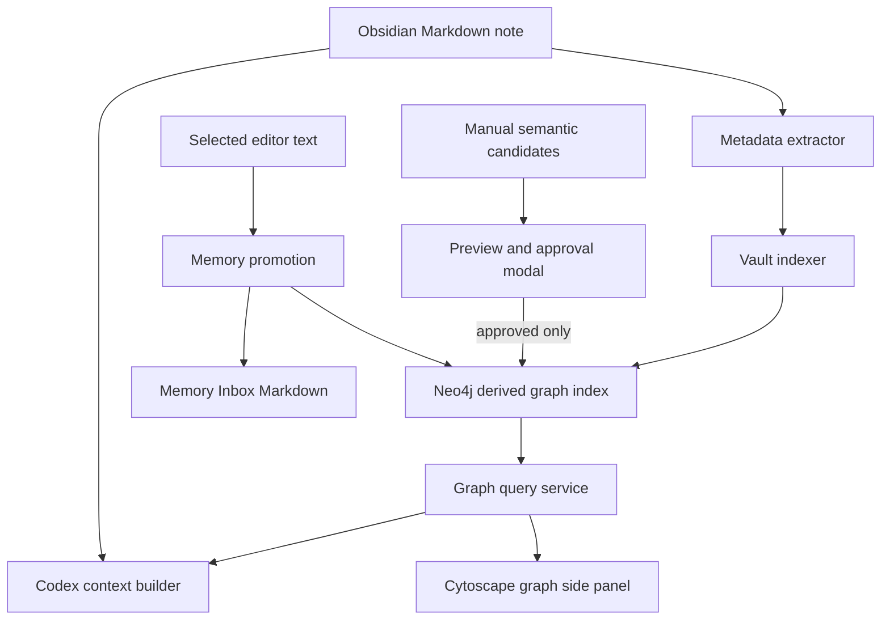

# Architecture

Context Graph Memory is an Obsidian desktop plugin. Obsidian Markdown remains the durable source of truth, while Neo4j is a rebuildable graph index. The Neo4j database is an external instance; the plugin does not embed or ship a database engine.

## Components

| Area | Files | Responsibility |
|---|---|---|
| Plugin entry | `src/main.ts` | Registers commands, views, settings, event handlers, context menus, and high-level workflows. |
| Settings | `src/types.ts`, `src/settings.ts` | Defines settings defaults and Obsidian settings UI. |
| Neo4j | `src/neo4j/*` | Driver wrapper, schema initialization, query constants, error sanitization. |
| Extraction | `src/extract/*` | Reads Obsidian metadata cache and Markdown body into structured metadata, relation candidates, and Data Forge compatibility reports. |
| Indexing | `src/indexing/*` | Upserts notes/tags/links/relations and processes changed-note queues. |
| Graph query | `src/graph/graph-scope.ts`, `src/graph/graph-query.ts` | Builds note/folder/selection graph queries and returns renderer-neutral `GraphResult`. |
| Graph rendering | `src/graph/cytoscape-*`, `src/views/graph-view.ts` | Adapts `GraphResult` to Cytoscape and renders the side panel. |
| Memory promotion | `src/memory/*` | Promotes selected text into explicit memory nodes and appends Memory Inbox Markdown. |
| Semantic enrichment | `src/semantic/*` | Reads manual candidate frontmatter, previews candidates, and saves only approved relationships. |
| Codex export | `src/export/*` | Builds and writes Codex-readable Markdown context files. |

## Data Flow

## Source Of Truth Boundary

Markdown notes are authoritative. Neo4j can be cleared and rebuilt by indexing the vault again. Plugin features must not silently rewrite source Markdown except for explicit generated outputs:

- `memoryInboxPath`
- `codexContextOutputPath`

## Runtime Boundary

The plugin does not run Codex CLI. The Codex export command only writes a Markdown file that a user can review and pass to Codex outside the plugin.

Data Forge compatibility is frontmatter-only in the current implementation. The plugin does not call the Data Forge runtime.

`DataForgeMetadataAdapter` builds a compatibility report from already extracted metadata. It reports detected Data Forge fields, normalized relation fields, and graph relation candidates. This adapter is intentionally read-only and does not import or modify the Data Forge plugin.

Semantic enrichment is also manual-only. `SemanticEnrichmentService` reads candidate frontmatter through an adapter interface, opens an approval modal, and writes to Neo4j only for approved candidates. It does not call an LLM, Codex CLI, or Data Forge runtime.

Runtime dependencies are intentionally narrow:

- `neo4j-driver` for database connectivity.
- `cytoscape` for interactive graph rendering.

## Error Handling

Neo4j errors are sanitized before being shown in Obsidian notices. Graph export degrades gracefully: if graph query fails, the export still writes the current note section and a sanitized graph warning.

## Build Output

`npm run build` runs TypeScript type checking and esbuild production bundling. Obsidian loads `manifest.json` and `main.js`.
